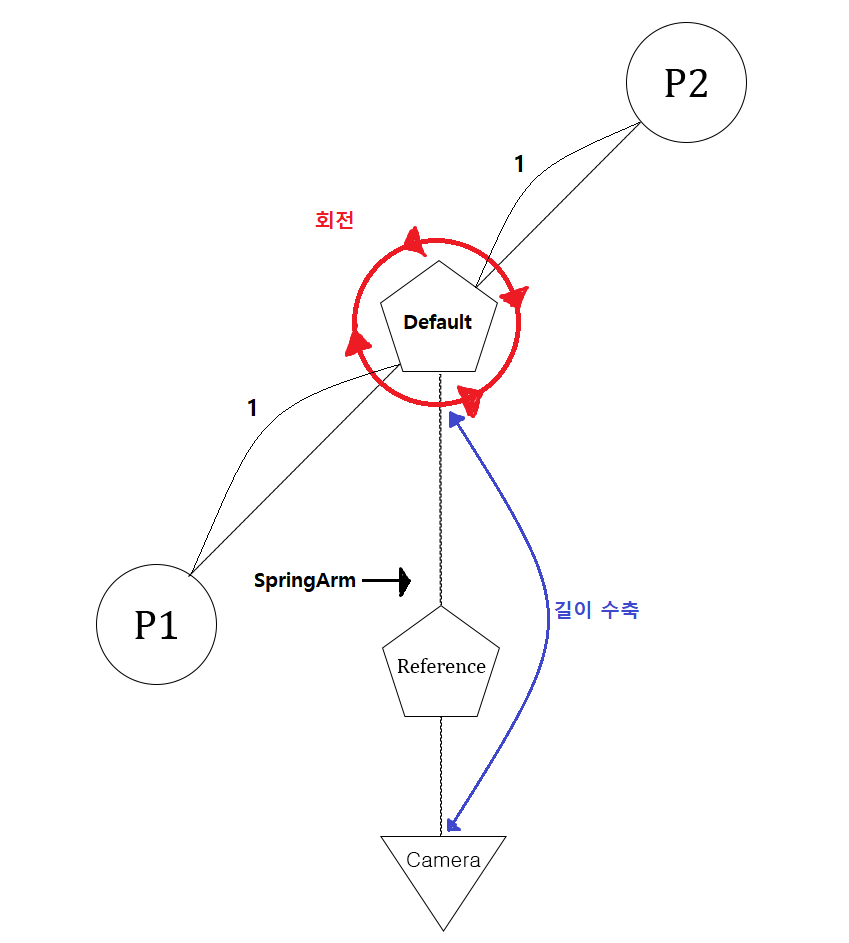
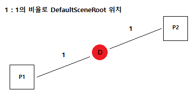
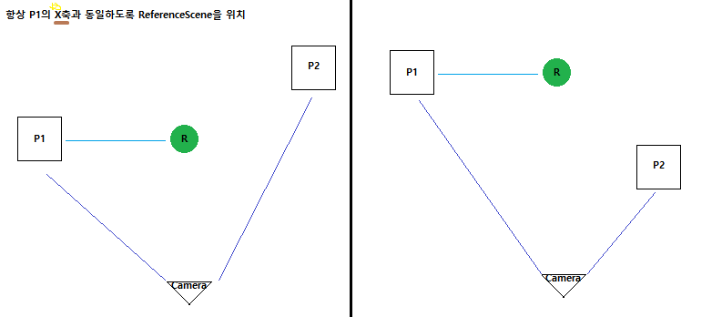
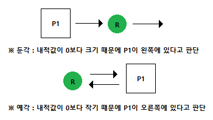
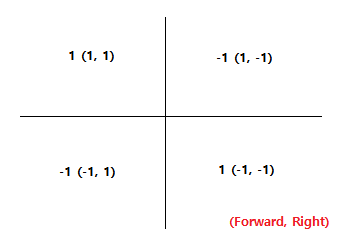
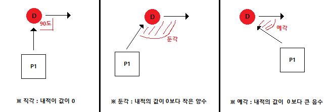

> # 게임 플레이 프로그래머_조민식_포트폴리오
  |||
  |:--:|:--:|
  |이름|조민식|
  |생년월일|1998.12.25|
  |이메일|richardqwe46@gmail.com|

>## 목차
|제목|설명|영상링크|
|:--:|:--:|:--:|
|1. [ActionCameraManager Plugin](#1.-ActionCameraManager-Plugin)|대전 격투 게임에 사용되는 카메라 플러그인|[플레이영상](https://youtu.be/iWDMIVvR27I), [비교영상](https://youtu.be/aYKv8t6HNXk)|
|2. [Battle Arena](#2.-Battle-Arena)|언리얼 엔진으로 제작한 RPG 게임|[플레이영상](https://youtu.be/Hd_fOEuh47s)|

> ## 1. ActionCameraManager Plugin
  |<h3>__ActionCameraManger__</h3>|<h3>__Naurto__</h3>|
  |:--:|:--:|
  |||
  |개발한 액션 카메라의 움직임|참조한 나루토 얼티밋 스톰4 의 카메라의 움직임|

  |||
  |:--:|--|
  |작업 기간|2022.03.09 ~ 2022.04.03 (약 한달)|
  |인력 구성|1인 개발|
  |프로젝트 목적|대전 격투 게임을 제작하기 위해서 카메라 플러인을 찾는 도중 본인이 원하는 플러그인이 없다는 것을 확인하고, 직접 플러그인을 제작 & 배포하여 다른 개발자들에게 유용함을 주기 위하여 진행|
  |프로젝트 내용|철권7, 나루토 얼티밋 스톰4 와 같은 __대전 격투 게임에서 사용하는 로컬 카메라 플러그인으로__ 총 3가지(2D_FIX, 2D, 3D)의 모드로 구성되고, 본 포트폴리오에서는 3D에 대해서만 기술|
  |주요 업무|카메라 구조 & 로직 구현, 플러그인 배포|
  |사용언어 및 개발 환경|C++, Unreal Engine(5.0.1), Visual Studio Community 2022, Window10|
  |참고 자료|[UnrealEngine MarketPlace](https://www.unrealengine.com/marketplace/en-US/product/6b542e9ad0b64686b1bf31dca9276316), [Preview Video](https://youtu.be/iWDMIVvR27I), [Setup Video](https://youtu.be/7N1cTe_sLFk), [Test Project](https://drive.google.com/file/d/1rqQjbcDdOxXinYIBNvA0E9hg38SsS1CW/view?usp=sharing), [GitHub(자세한 설명)](https://github.com/Goaway-1/ActionCameraPlugin)|

  - ### **<h3>구조 및 원리</h3>**
    - 

    |Component|Explanation|
    |:--:|--|
    |__Players (P1, P2)__|게임에 참여하는 각 플레이어(Player1, Player2)들을 의미|
    |__DefaultSceneRoot(Default)__|두 플레이어의 중심좌표을 표현하며 동시에 회전을 담당하는 컴포넌트|
    |__ReferenceScene(Reference)__|P1의 주변 X 좌표를 표현하여 회전 시 참고하기 위한 컴포넌트|
    |__SpringArmComp(SpringArm)__|플레이어 간의 거리 변경시, SpringArm의 길이 & 회전 각도가 조절되는 컴포넌트|
    |__CameraComp(Camera)__|플레이어가 보게 되는 시점으로 SpringArmComp에 의존하기에 따로 움직임은 없음|

  - ## **주요 작업 내용**
    - ## __1. SpringArm의 길이/각도 조정__
      - __기능 소개__ : 플레이어 간의 거리를 기준으로 SpringArm의 길이와 각도를 조정하여, 두 플레이어가 카메라 시점에 잡히도록 조정
      - ### __1_1. DefaultSceneRoot의 위치 지정__
        - 

        - 위 영상처럼 DefaultSceneRoot는 항상 두 플레이어의 중심에 위치
          
          <details><summary>참조 코드</summary> 

          ```c++
          void AMainCameraManager::SetCameraPosition() {
            FVector DefaultLocation = (Players[0]->GetActorLocation() + Players[1]->GetActorLocation()) / 2.f;
            DefaultLocation.Z += Height;
            DefaultSceneRoot->SetWorldLocation(DefaultLocation);
          }
          ```
          </details>

      - ### __1_2 : SpringArm의 길이/각도 조정__
        - 
        - SpringArm은 DefaultSceneRoot에 부착되어 있으며, 길이(Length)와 상하 회전(Rotate:Pitch)은 플레이어들 간의 거리에 영향을 받음
        - 위 영상처럼 거리가 멀어질수록 SpringArm의 길이와 회전 값이 변화되어 플레이어들을 화면상에 모두 표현 가능 

          <details><summary>참조 코드</summary> 

          ```c++
          void AMainCameraManager::SetCameraPosition() {
            /** 플레이어들 사이의 거리를 고정된 값(1200.f)으로 나누어 0 ~ 1까지의 값으로 고정 */
            float P1ToP2Distance = (Players[1]->GetActorLocation() - Players[0]->GetActorLocation()).Size() / 1200.f;
            GlobalDistanceFactor = UKismetMathLibrary::FClamp(P1ToP2Distance, 0.f, 1.f);

            /** 최소/최대 길이&회전 값과 선형 보간 함수(Lerp)를 사용하여, 최소 최대 사이의 위치한 알파값 계산 */
            float SpringPitch = UKismetMathLibrary::Lerp(MaxSpringArmRotation, MinSpringArmRotation, GlobalDistanceFactor) * -1.f;
            SpringArmComp->SetRelativeRotation(FRotator(SpringPitch, 0.f, 0.f));                // SpringArm의 회전 조정

            /** SpringArm의 길이 조정 */
            FVector P1ToP2Vector = Players[1]->GetActorLocation() - Players[0]->GetActorLocation();
            P1ToP2Vector.Z = 0;
            float P1ToP2CenterLength = (P1ToP2Vector / 2.f).Size();
            float SpringArmLength = UKismetMathLibrary::Lerp(SpringArmBaseDistance, (SpringArmBaseDistance + SpringArmExtraDistance), GlobalDistanceFactor);

            SpringArmComp->TargetArmLength = P1ToP2CenterLength + SpringArmLength;  
          }
          ```
          </details>

    - ## __2. DefaultSceneRoot의 회전__
      - __기능 소개__ : P1의 상대적인 위치들을 판단하여 ReferenceScene와 멀어진 만큼 DefaultScene를 회전
      - ### __2_1. ReferenceSence의 위치지정__
        - 
        - ReferenceSence는 DefaultSceneRoot에게 부착되어있기에 Default로부터 거리를 유지하고, 항상 P1와 같은 X축에 존재

          <details><summary>참조 코드</summary> 

          ```c++
          void AMainCameraManager::SetReferenceScene() {
            float P1ToP2_HalfDistance = ((Players[0]->GetActorLocation() - Players[1]->GetActorLocation()).Size()) / 2.f;

            /** ReferenceScene을 P1의 같은 X축에 배치 (거리 = P1과 P2 사이의 절반 거리) */
            FVector Vec = (P2ToCamera_Distance > P1ToCamera_Distance) ? FVector(P1ToP2_HalfDistance * -1.f, 0.f, 0.f) : FVector(P1ToP2_HalfDistance, 0.f, 0.f);
            ReferenceScene->SetRelativeLocation(Vec);
          }
          ```
          </details>

      - ### __2-2. P1의 상대적인 위치 판단__
        -  
        - __좌우 판단__ : P1에서 Reference로의 방향벡터와 Reference에서의 오른쪽 방향벡터를 스칼라 곱하여 내적. 만약 0보다 작다면 Reference를 기준으로 P1이 오른쪽(-1), 크다면 왼쪽(1)에 있는 것으로 판정
        - __상하 판단__ : 각각의 P1, P2와 카메라까지의 거리를 계산하고, P1이 카메라에 더 가까이 있다면 P1이 P2에 비해 앞(1)에 있다고 판정하고, 그렇지 않다면 뒤(-1)에 있다고 판정
        - 상하좌우를 판단하는 것을 오른쪽 위와 같은 표로 표현 가능 (항상 P1을 기준으로 판단)

          <details><summary>참조 코드</summary> 
            
          ```c++
          void AMainCameraManager::SetP1RelativeVal() {
            /** P1에서 Reference의 방향벡터와 Reference의 오른쪽 방향 벡터를 스칼라 곱하여 내적을 구하고, 이 값을 기준으로 좌우를 판단 */
            FVector P1ToRef_DirectionVec = UKismetMathLibrary::GetDirectionUnitVector(Players[0]->GetActorLocation(), ReferenceScene->GetComponentLocation());
            float P1ToRef_InnerVec = UKismetMathLibrary::Dot_VectorVector(ReferenceScene->GetRightVector(), P1ToRef_DirectionVec);
            IsLeft = (P1ToRef_InnerVec <= 0.f) ? -1.f : 1.f;

            /** 각각의 P1, P2와 카메라까지의 거리를 계산하고, 어떤 플레이어가 더 앞에 있는지 판단 */
            P1ToCamera_Distance = (Players[0]->GetActorLocation() - CameraComp->GetComponentLocation()).Size();
            P2ToCamera_Distance = (Players[1]->GetActorLocation() - CameraComp->GetComponentLocation()).Size();
            IsForward = (P2ToCamera_Distance > P1ToCamera_Distance) ? 1.f : -1.f;
          }
          ```
          </details>

      - ### __2-3. DefaultSceneRoot의 회전__
        - 
        - P1과 Reference간의 거리가 일정 거리보다 멀어진다면 떨어진 거리만큼 DefaultSceneRoot에 초당 힘을 주어 회전

          <details><summary>참조 코드</summary> 

          ```c++
          void AMainCameraManager::RotateDefaultScene() {
            float P1ToReference_Length = (Players[0]->GetActorLocation() - ReferenceScene->GetComponentLocation()).Size();

            /** P1ToReference_Length가 MinRotDistance보다 크면 DefaultSceneRoot를 회전 */
            if (P1ToReference_Length >= MinRotDistance) {
              /** 힘의 세기는 거리에 따라 증가 */
              float Force = (P1ToReference_Length - MinRotDistance) / RotationDelay;
              float YawForce = ((IsForward * IsLeft) * Force) * UGameplayStatics::GetWorldDeltaSeconds(this);
              DefaultSceneRoot->AddWorldRotation(FRotator(0.f, YawForce, 0.f), false, false);
            }
          }
          ```
          </details>

    - ### __3. 자동회전__
      -   
      - __기능 소개__ : 두 플레이어가 겹쳐 카메라 시점에 잡히지 않는다면, 자동으로 회전 
      - P1에서 Default간의 내적 벡터가 일정 각도 이내이면 겹친다고 판정되어 회전
      - 두 플레이어가 모두 움직임이 없는 상황에만 적용

        <details><summary>참조 코드</summary> 

        ```c++
        void AMainCameraManager::SetP1RelativeVal() {
          /** P1에서 Default로의 방향벡터를 구하고, 이 벡터와 Default의 오른쪽 방향 벡터를 스칼라 곱하여 내적을 계산 */
          FVector P1ToRoot_DirectionVec = UKismetMathLibrary::GetDirectionUnitVector(Players[0]->GetActorLocation(), DefaultSceneRoot->GetComponentLocation());
          P1ToRoot_InnerVec = UKismetMathLibrary::Dot_VectorVector(DefaultSceneRoot->GetRightVector(), P1ToRoot_DirectionVec);
        }
        void AMainCameraManager::SetViewAllPlayers() {
          /** 플레이어의 움직임이 없다면 오버랩 판정 가능 */
          if (Players[0]->GetVelocity().Size() <= 0.1f && Players[1]->GetVelocity().Size() <= 0.1f) {
            float AbsInnerVal = FMath::Abs(P1ToRoot_InnerVec);
            if (AbsInnerVal < MinOverlapInnerVal && !bIsPlayersOverlap) bIsPlayersOverlap = true;

            /** 내적의 크기에 따라 겹쳐졌다고 판정되면 SetNonOverlap()메서드 실행 */
            if (bIsPlayersOverlap) SetNonOverlap();
          }
          else bIsPlayersOverlap = false;
        }
        void AMainCameraManager::SetNonOverlap() {
          /** P1과 Default간의 내적 크기 파악 */
          float P1ToRootFactor = UKismetMathLibrary::FClamp((Players[0]->GetActorLocation() - DefaultSceneRoot->GetComponentLocation()).Size() / 800.f, 0.f, 1.f);
          float DeActiveRange = UKismetMathLibrary::Lerp(MaxOverlapInnerVal, MinOverlapInnerVal, P1ToRootFactor);	

          float YawForce = ((IsForward * IsLeft) * (OverlapRotateForce * DeActiveRange)) * UGameplayStatics::GetWorldDeltaSeconds(this);
          DefaultSceneRoot->AddWorldRotation(FRotator(0.f, YawForce, 0.f), false, false);

          /** 내적 값을 초과할 경우 겹쳐짐을 해소했다고 판단하고 종료*/
          if (FMath::Abs(P1ToRoot_InnerVec) >= DeActiveRange)  bIsPlayersOverlap = false;
        }
        ```
        </details>

  - ### __<h3>가장 신경 쓴 부분와 겪은 수행 착오</h3>__
    - 카메라 매니저의 구조, 로직에 대한 설계에 대해서 가장 신경을 썻습니다.
      - 철권7과 같은 2D모드 형식의 설계는 어렵지 않았지만, 나루토 얼티밋 스톰과 같은 3D모드 형식의 설계가 어려웠습니다. 어떠한 조건에 영향을 받아서 Default의 회전이 이루어지는지에 대해서 가장 고민을 많이 하였습니다.
      - 직접 게임을 플레이하면서 어떠한 조건에 영향을 받아 회전하는지 생각하였고, 그 결과 2가지의 방법을 구상하게 되었습니다.
      
      - ### 1. <U>플레이어들의 뷰포트 상(플레이 화면)의 위치를 받아 일정 영역의 범위를 벗어나면, 범위안에 유지하도록 회전하는 방식입니다.</U>
        - 가장 먼저 생각난 로직이었지만, 플레이창의 해상도에 영향을 받기 때문에 정확한 계산이 어려울 것이라는 단점이 존재했습니다.
      - ### 2. <U>참조 컴포넌트와 P1과의 거리에 따라 회전하는 방식입니다.</U>
        - 참조 컴포넌트는 P1과 같은 X축에 배치하고, 항상 카메라의 중심에 위치하도록 합니다.
        - 이 컴포넌트와 P1의 사이의 거리가 일정 범위를 벗어난다면, 그 방향으로 회전합니다.
        - 1번 방법과는 다르게 해상도에 영향을 받지 않기 때문에 계산에 오차가 발생하지 않습니다.

  - ### __<h3>개선점</h3>__
    ### 1. <U>네트워크를 지원하지 않았고 로컬에서만 사용이 가능하기 때문에 사용범위가 넓지 않다는 점이 단점입니다.</U>
      - 추후 로컬과 온라인 2가지의 모드로 구분하여 개선해나갈 예정입니다.
    ### 2. <U>플러그인을 사용하기 위해서는 월드에 있는 플레이어를 직접 카메라와 연결해야 된다는 점이 강한 연결을 띄고 있어 부적절하다고 판단합니다.</U>
      - 자동으로 탐색하는 것이 아닌 플레이 전에 카메라 매니저와 직접 연결을 진행해야 되는데 이는 강한 연결을 띄고 있고, 온라인에서의 사용 또한 부적절합니다.
      - 따로 플레이어들의 접속을 관리하는 매니저를 개발하고, 접속이 확인되면 카메라 매니저에게 넘겨주어서 처리하는 방향으로 개선이 필요합니다.
    
> ## 2. Battle Arena
  |||
  |:--:|--|
  |작업 기간|2021.07.26 ~ 2022.01.30 (약 7달 : 실기간 2달)|
  |인력 구성|1인 개발|
  |프로젝트 목적|초기 끝이 없이 진행되는 도전의 탑과 같은 게임을 제작하려고 했지만 방향을 바꾸어 RPG에서 사용되는 대부분의 기술을 구현하여 실력 향상 하는 것을 목표로 진행|
  |프로젝트 내용|RPG 내에서 이루어지는 전투 시스템, 상호작용, 타겟팅과 같은 다양한 기술들을 구현|
  |주요 업무|기획 및 개발|
  |사용언어 및 개발 환경|C++, Unreal Engine(4.26.2), Visual Studio Community 2019, Window10|
  |참고 자료|[Preview Video](https://youtu.be/Hd_fOEuh47s), [GitHub(자세한 설명)](https://github.com/Goaway-1/Battle_Arena)|

  - ### **<h3>주요 작업 내용</h3>**
    ### 1. 공격 판정(콜리전)
      - 
      - __기능 소개__ : 플레이어가 장착하고 있는 무기의 콜리전을 활용한 공격 판정 방법
      - 무기의 콜리전을 On/Off하는 방식으로 On상태일때 Overlap되면 피격 판정 
      - 무기를 한번 휘두를 때 중첩되어 2번 이상 피해를 받는 오류가 발생할 수 있기에 공격 시 “공격자의 이름 + 무기의 이름 + 카운트 번호”로 피격 대상에게 제공
      - 피해자는 CurrentAttack과 LastAttack을 비교하여 다른 경우에만 피격 처리
      
        <details><summary>참조 코드</summary> 

        ```c++
        //AttackWeapon.cpp
        /** AttackCollision의 콜리전 On/Off 여부 */
        void AAttackWeapon::SetAttackCollision(bool value) {	
          if(!value) AttackCollision->SetCollisionEnabled(ECollisionEnabled::NoCollision);
          else AttackCollision->SetCollisionEnabled(ECollisionEnabled::QueryOnly);
        }
        void AAttackWeapon::OnAttackOverlap(UPrimitiveComponent* OverlappedComponent, AActor* OtherActor, UPrimitiveComponent* OtherComp, int32 OtherBodyIndex, bool bFromSweep, const FHitResult& SweepResult) {
          if (OtherActor) {
            AEnemy* Enemy = Cast<AEnemy>(OtherActor);
            AMainPlayer* Player = Cast<AMainPlayer>(AtOwner);
            ABoss_Enemy* BEnemy = Cast<ABoss_Enemy>(Enemy);

            /** 적의 CurrentAttack정보를 갱신하고 ApplyDamage()메서드로 피격 처리 */
            if (Enemy) {  
              Enemy->SetCurrentAttack(AtOwner->GetName() + this->GetName() + FString::FromInt(Player->GetAttackCnt()));
              UGameplayStatics::ApplyDamage(Enemy, Damage, AtController, AtOwner, AtDamageType);
            }
          }
        }
        ```
        ```c++
        //Enemy.cpp
        float AEnemy::TakeDamage(float DamageAmount, struct FDamageEvent const& DamageEvent, class AController* EventInstigator, AActor* DamageCauser) {
          /** 마지막 피격과 최근 피격정보가 다른 경우 LastAttack을 갱신하고 피격처리 */
          if(CurrentHealth <= 0) return 0;
          else if (LastAttack != CurrentAttack ) LastAttack = CurrentAttack;      
          else if (DamageEvent.DamageTypeClass != InternalDamageType) return 0;
          else return 0;
        }
        ```
        </details>
  
    ### 2. 공격 판정(내적)
      - 
      - __기능 소개__ : 기존 무기의 콜리전 방식이 아닌 트레이스 채널과 내적을 사용한 공격 방식
      - 하나의 AttackFunction클래스에서 Player와 Enemy가 모두 사용.
      - 공격자의 주변에서 채널과 일치하는 타입의 액터들을 찾고, 그 액터들과 공격자 간의 내적의 크기가 일정 범위내라면 피격  처리
      - 위의 영상처럼 내적의 크기를 기준으로 피격을 판단하며, 장점은 공격 타입에 따라 범위를 지정할 수 있다는 점

        <details><summary>참조 코드</summary> 

        ```c++
        //AttackFunction.cpp
        void UAttackFunction::SkillAttackStart(TSubclassOf<UDamageType> DamageType,FString OwnerType, UParticleSystem* HitParticle,float AttackRange,float Damage, int AttackCnt){
          TArray<TEnumAsByte<EObjectTypeQuery>> TraceObjectTypes;
          UClass* SeekClass = nullptr;		//찾아낼 클래스
          TArray<AActor*> OutActors;			//찾아낼 액터들
          TArray<AActor*> IgnoreActors;	
          IgnoreActors.Init(Owner, 1);

          /** 찾아낼 클래스와 트레이스 채널 지정 */
          if (Type == "Player") {
            TraceObjectTypes.Add(UEngineTypes::ConvertToObjectType(ECollisionChannel::ECC_GameTraceChannel2));
            SeekClass = AEnemy::StaticClass();
          }
          else if (Type == "Enemy") {
            TraceObjectTypes.Add(UEngineTypes::ConvertToObjectType(ECollisionChannel::ECC_GameTraceChannel1));
            SeekClass = AMainPlayer::StaticClass();
          }

          /** 원하는 액터가 감지되었다면 True를 반환 */
          bool bResult = UKismetSystemLibrary::SphereOverlapActors(GetWorld(), Owner->GetActorLocation(), AttackRange, TraceObjectTypes, SeekClass, IgnoreActors, OutActors);

          /** 피격 시 녹색구로 표시 */
          FColor DrawColor = FColor::Red;
          if (bResult) {
            for (auto& HitActor : OutActors) {
              
              /** 내적 판단 */
              float Inner = Owner->GetDotProductTo(HitActor);	
              if (Inner > 0.3f) {
                if (Type == "Player") {
                  auto EHited = Cast<AEnemy>(HitActor);
                  EHited->SetCurrentAttack(Owner->GetName() + EHited->GetName() + FString::FromInt(AttackCnt));
                  if (EHited) UGameplayStatics::ApplyDamage(EHited, Damage, Controller, Owner, DamageType);
                }
                else if (Type == "Enemy") {
                  auto MHited = Cast<AMainPlayer>(HitActor);
                  MHited->SetCurrentAttack(Owner->GetName() + MHited->GetName() + FString::FromInt(AttackCnt));
                  if (MHited) UGameplayStatics::ApplyDamage(MHited, Damage, Controller, Owner, DamageType);
                }
                DrawColor = FColor::Green;
              }
            }
          }
          DrawDebugSphere(GetWorld(), Owner->GetActorLocation(), AttackRange, 12, DrawColor, false, 0.5f);
        }
        ```
        </details>

  - ### **<h3>가장 신경 쓴 부분와 겪은 수행 착오</h3>**
    - 공격 시 피격 판정에 대해서 어떤 방식으로 처리할지 가장 많이 고민했습니다. 그렇게 2가지의 방법을 구상하였습니다.
      - ### 1. 무기의 콜리전과 피격 대상의 충돌 판정
        - 무기의 콜리전을 ON/OFF하는 방식으로, 콜리전과 충돌 시 피격판정을 합니다.
        - 내적 방식과는 다르게 실제 객체가 충돌해야 피격 처리가 되기 때문에 정확한 판정이 가능합니다.
        - 하지만 중복으로 피격되는 경우가 발생하였고, 이를 해결하기 위해서 피격받은 대상에게 정보(공격자의 정보+콤보횟수)를 넘기고, 다음 피격 시 정보가 같은지 확인하고, 다르다면 피격 처리를 합니다.

      - ### 2. 내적을 사용하여, 공격자와 대상의 위치에 따른 피격 판정
        - 공격자로부터 일정 범위 내에 있는 모든 피격 대상을 찾고, 그 대상들에 대해 일정 각도 내에 있는지 확인하여 피격판정을 합니다.
        - 이는 1번과 같이 중복되어 피격되는 문제는 발생하지 않지만, 범위를 기반으로 피격을 처리하기 때문에 무기에 닿지 않아도 피격되는 문제가 발생합니다.
        - 그렇기에 범위 공격과 같은 특별한 공격에 사용했습니다.

  - ### **개선점**
    - 공격처리나 아이템과 같은 클래스들은 상속을 이용하여 개발하고, 이들을 플레이어에게 컴포지션하여 사용했지만 중복되는 코드가 발생했습니다. 
      - 중복은 클래스 간 호환이 되지 않았기에 중복하여 작성하였고, 이를 개선하기 위해서는 어댑터 패턴을 만족하는 새로운 클래스를 제작하여 처리해야 한다고 생각합니다.
---
<center><h1>감사합니다.</h1></center>  